# ggextreme

<!-- badges: start -->
[](https://github.com/choxos/ggextreme/actions/workflows/R-CMD-check.yaml)
[](https://opensource.org/licenses/MIT)
<!-- badges: end -->

Presentation quality charts built on **ggplot2** that the package itself does
not provide. There are fifteen so far:

* **Bar chart races**: an animation of a ranking that changes over time, of
  the kind used to summarize long panels in talks, teaching material and
  journal supplements.
* **Interactive causal diagrams**: a directed acyclic graph in which every
  node and arrow carries its rationale and references, shown on hover and
  opened in full on click, and which can show the paths an adjustment set
  leaves open.
* **Interactive network plots**: the network of a network meta-analysis,
  with the baseline characteristics and outcomes of every arm behind each
  treatment and comparison.
* **Interactive forest plots**: a meta-analysis with each study's record and
  risk of bias traffic lights, and a cumulative replay as an animation.
* **League tables**: every estimate of a network meta-analysis, with its
  direct and indirect evidence, where that evidence flows from, and a ranking
  of the treatments.
* **Confidence in a network meta-analysis**: five plots that follow CINeMA,
  from a league table with a confidence profile in every cell to the studies
  each estimate rests on, estimates against a movable range of little
  difference, and direct against indirect evidence.
* **Funnel plots**: small-study effects with significance contours, the
  pooled estimate without each study, trim and fill and the tests for
  asymmetry.
* **Kaplan-Meier plots**: survival curves that read every group, and the
  hazard ratio, at any time under the pointer, with a linked risk table,
  proportional hazards tests and the restricted mean survival time up to a
  movable horizon.
* **Swimmer plots**: one lane per patient, with responses, progression and
  death along it, that reorders on demand, with a waterfall of best change
  and each patient's course linked to the lanes.
* **Responder thresholds**: the whole distribution of change by arm, the
  responders at a prespecified threshold and the difference at every other.
* **Diagnostic thresholds**: what the cutoff of a test means for 1,000
  people at any prevalence, beside the distributions, the ROC curve and the
  predictive values.
* **Bias and tipping points**: how strong unmeasured confounding would have
  to be to change a conclusion, with E-values and measured benchmarks.
* **A multiverse of analyses**: every defensible analysis of one question as
  a specification curve, with the choices that move it.
* **Nomograms**: any regression model, from logistic and Cox to mixed,
  ordinal and multinomial models, as a nomogram whose handles move, with the
  prediction and its confidence interval computed in the page.
* **Choropleth maps**: a map of the world, or of any 'sf' map, that steps or
  plays through the years, with several measures side by side for the same
  year.

All fifteen are drawn as ordinary `ggplot` objects. Nothing is hidden behind a
separate rendering engine, so a frame or a diagram can be inspected, modified
or saved on its own.

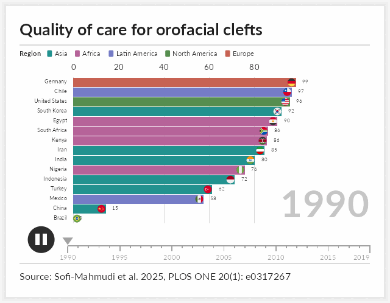

## Installation

```r
# install.packages("remotes")
remotes::install_github("choxos/ggextreme")
```

Writing output requires an encoder: **gifski** or **magick** for GIF, **av**
or an `ffmpeg` binary for MP4. Images on the bars require **magick**.

## Bar chart races

`ggrace()` takes long data with one row per entity per time point, and three
bare column names for the value, the label and the time.

```r
library(ggextreme)

race <- ggrace(
  clefts_qci,
  value = qci,
  name = country,
  time = year,
  top_n = 15,
  duration = 15,
  title = "Quality of care for orofacial clefts",
  caption = "Source: Sofi-Mahmudi et al. 2025, PLOS ONE 20(1): e0317267"
)

race_frame(race, 200)          # one frame, as a ggplot
animate_race(race, "race.mp4") # draw every frame and encode
```

`time` may be numeric or a `Date`. Each entity and time pair must appear
once; a repeat is an error rather than a silent average. The encoder is
chosen from the file extension, and frames are drawn across cores by default.

Selected arguments:

| argument | effect |
| --- | --- |
| `top_n` | number of bars visible at once |
| `duration`, `fps`, `end_pause` | length in seconds, frame rate, hold on the final frame |
| `swap` | seconds a bar takes to move into a new rank |
| `group` | color bars by category and draw a legend |
| `palette`, `breaks` | bar colors; gridline positions |
| `label_value`, `label_time` | formatters for the bar numbers and the time label |
| `images` | pictures placed at the end of the bars |
| `timeline`, `play_button`, `card` | optional chrome around the plot |
| `width`, `res` | output size; the layout scales with `width` |

### Coloring by group

Passing a `group` column colors the bars by category rather than
individually and draws a legend above the axis. Each entity must belong to
exactly one category; a factor keeps the legend in the order of its levels.

```r
ggrace(
  clefts_qci, qci, country, year,
  group = region,
  legend_title = "Region",
  top_n = 15
)
```

The card grows to make room for the legend, wrapping onto more rows when the
categories do not fit across it. `legend = FALSE` keeps the coloring and
drops the legend.

### Images on the bars

`images` takes image file paths named by entity. Pictures are cropped to a
circle and right aligned just inside the end of each bar; entities without an
image simply get none. A circular flag for every ISO 3166-1 country, plus
Kurdistan, is bundled, so country races need no extra files.

```r
key <- unique(clefts_qci[c("country", "iso")])
flags <- setNames(race_flags(key$iso), key$country)

ggrace(clefts_qci, qci, country, year, top_n = 15, images = flags)
```

Any image works, not only flags. Pass paths to logos, portraits or crests in
the same way.

### Design notes

Three choices govern how the animation reads. They are set out in full in
`vignette("how-the-animation-works")`.

* **Values are interpolated on a uniform time grid.** Bars grow at a steady
  rate, and unevenly spaced observations play at their true relative speed.
* **Rank is not interpolated.** Every frame is ranked on its own values, and
  a bar that changes rank eases into the new position over `swap` seconds.
  Bars therefore rest in place and trade positions in one short move rather
  than drifting for a whole time step.
* **The geometry is fixed.** The label column has a constant width and the
  panel edges are constants, so the chart does not shift sideways when the
  longest name enters or leaves the visible window. Colors are assigned once
  across the whole field, so an entity keeps its color when it drops out and
  returns.

## Interactive causal diagrams

`ggcausal()` draws a DAG from two data frames: `edges`, with one row per
arrow, and `nodes`, with one row per variable. A `rationale` and
`references` column on either one explains why that node or arrow is in the
diagram. Hovering shows the rationale; clicking opens a panel with the full
text and clickable references, which also works on touch screens.

```r
dag <- ggcausal(cleft_dag$edges, cleft_dag$nodes, legend_title = "Role")
dag                           # interactive widget
graph_save(dag, "dag.html")   # a single file for a supplement
graph_save(dag, "dag.png")    # a static figure
```

[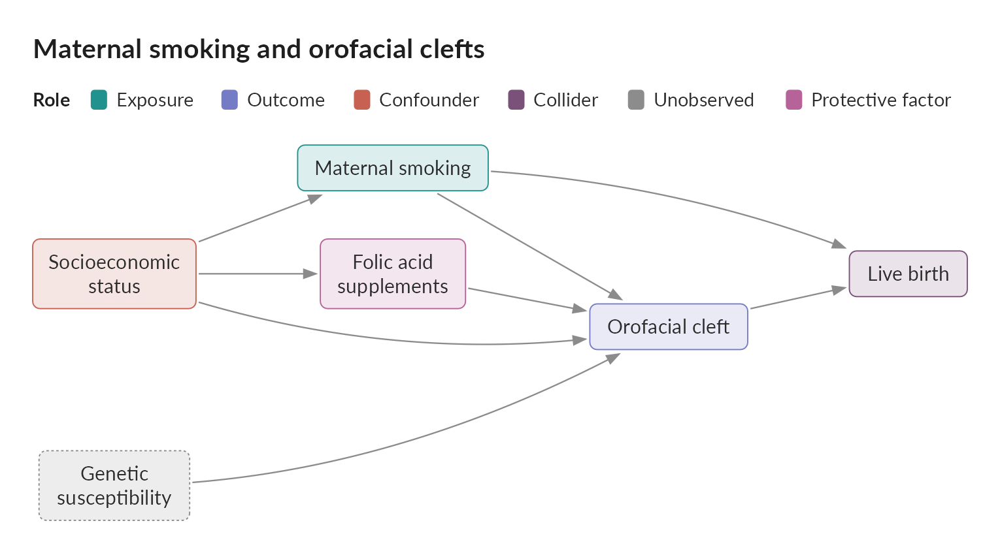](https://choxos.github.io/ggextreme/articles/causal-diagrams.html)

GitHub cannot run the widget, so the image above is static. The
[interactive version](https://choxos.github.io/ggextreme/articles/causal-diagrams.html)
is on the package website.

Nodes are colored by `role`, with fixed colors for exposures, outcomes,
confounders, mediators, colliders, instruments and unobserved variables.
The layout is layered so that every arrow points the same way, and an arrow
that skips a layer bends around the boxes in between; `x` and `y` columns
place the boxes by hand instead. Any other column in either data frame
appears as a labeled field. The widget embeds a web copy of Lato and works in
R Markdown, Quarto, 'pkgdown' and 'shiny'.

With `paths = TRUE`, the diagram shows which paths between the exposure
and the outcome are open or blocked: click a variable to adjust for it, and
a panel under the diagram says whether the set is sufficient by the backdoor
criterion, why each path is open or blocked, and which minimal sets would
be.

```r
ggcausal(cleft_dag$edges, cleft_dag$nodes, paths = TRUE, adjust = "ses")
```

## Interactive network plots

`ggnma()` draws the network of a network meta-analysis from arm level data,
one row per study arm. Nodes are treatments and lines join treatments
compared directly in at least one study; node area follows the number of
participants, line width the number of studies, and a shaded polygon joins
the treatments of each multi-arm study. Hovering over a node, line or
polygon shows its arms side by side, in the manner of a trial's baseline
table, with the columns chosen in `hover`; clicking opens the full table
with every other column of the data as a row.

```r
net <- ggnma(psoriasis_nma, study, treatment, n = n, group = class,
             legend_title = "Class")
net                              # interactive widget
graph_save(net, "network.html")  # a single file for a supplement
```

[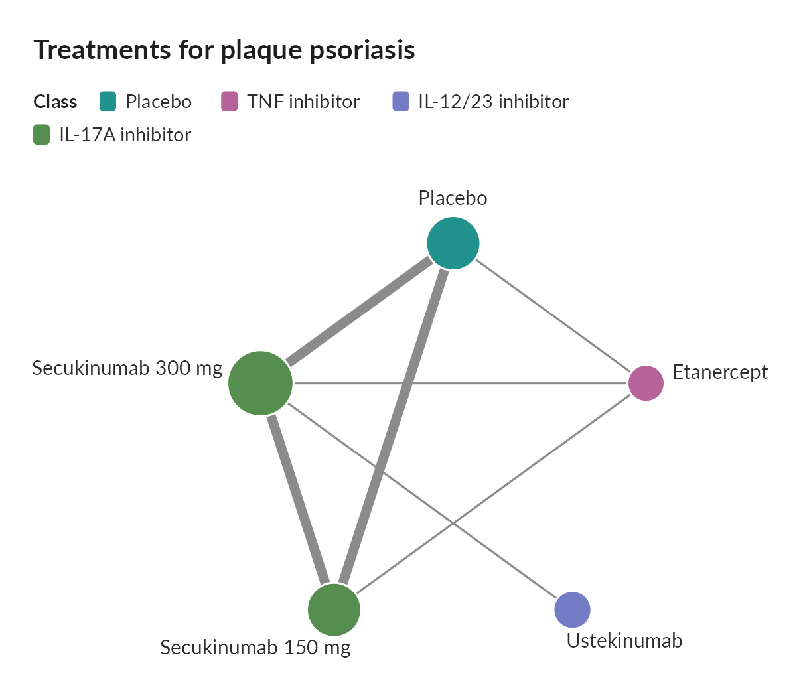](https://choxos.github.io/ggextreme/articles/network-plots.html)

The [interactive version](https://choxos.github.io/ggextreme/articles/network-plots.html)
is on the package website. Nodes sit on a circle or wherever `positions`
places them. Rows of the arm tables are named from each column's `label`
attribute, text that is the same across a study, such as a
reference, is listed once per study, and DOIs and URLs are linked.

With `contributions`, a netmeta fit on the same network, the widget gains a
menu of comparisons; picking one widens each line by the share of that
network estimate flowing through it.

## Interactive forest plots

`ggmeta()` draws the forest plot of a fitted meta-analysis, a metafor
`rma()` fit or a meta object. Hovering over a study shows its effect, weight
and chosen columns, and clicking it opens every column of its record. Risk
of bias judgments, from RoB 2, RoB 1 or ROBINS-I, are drawn as traffic
lights beside each study.

```r
ggmeta(fit,
       columns = c("P2Y12 inhibitor" = "p2y12", Aspirin = "aspirin"),
       rob = c(R = "rob.R", D = "rob.D", Mi = "rob.Mi", Me = "rob.Me",
               S = "rob.S", Overall = "rob.overall"),
       favors = c("Favors P2Y12 inhibitor", "Favors aspirin"))
```

[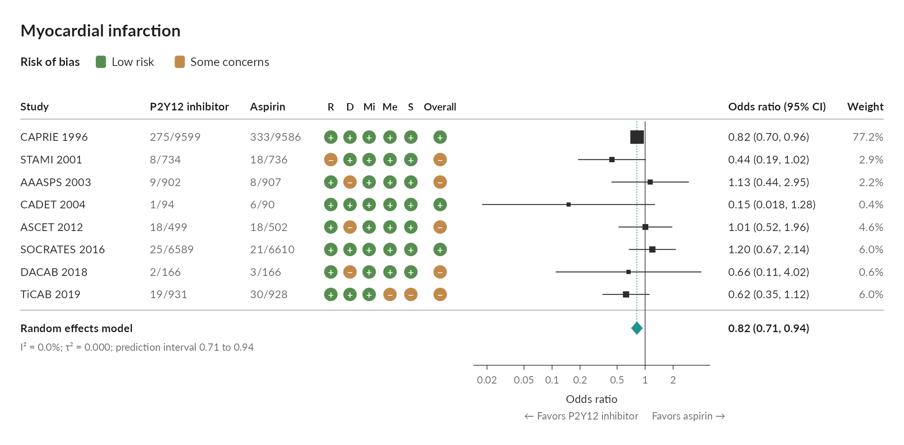](https://choxos.github.io/ggextreme/articles/forest-plots.html)

`cumulative = TRUE` shows the pooled estimate after each study, and
`animate_meta()` replays it as a GIF or MP4, each trial fading in as the
pooled diamond eases to its new value:

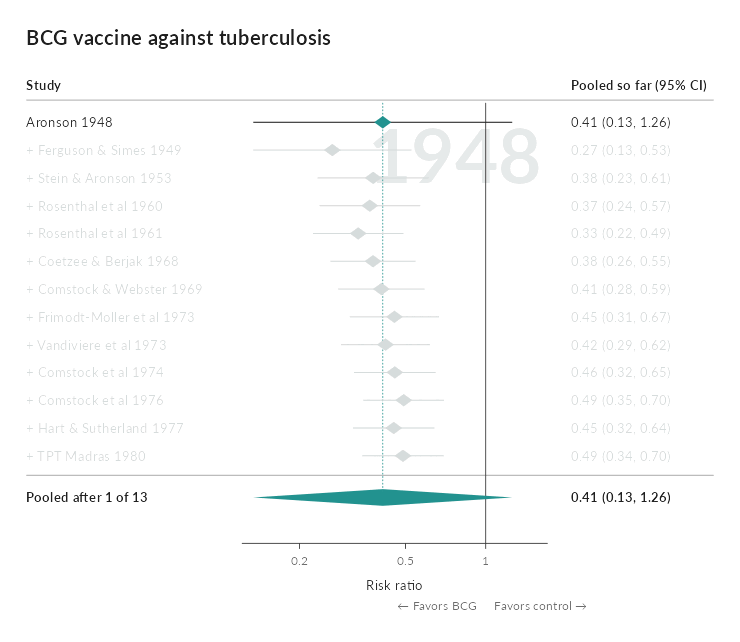

## League tables

`ggleague()` draws every estimate of a netmeta fit as a grid, network
estimates below the diagonal and direct estimates above it, following
`netmeta::netleague()`, with a P-score ranking beside it. Hovering over a
cell shows the network, direct and indirect estimates and the share that
comes from direct trials; clicking it opens the direct trials arm by arm.

```r
ggleague(nma, psoriasis_nma, study, treatment, small_values = "undesirable")
```

[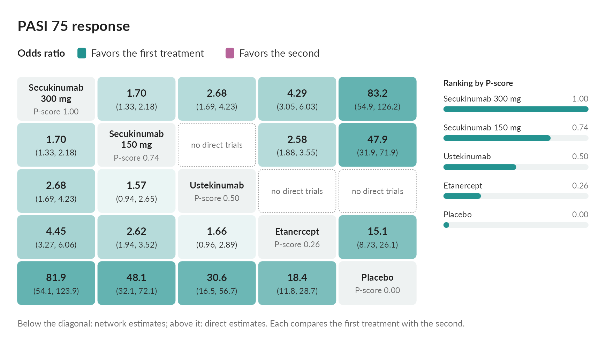](https://choxos.github.io/ggextreme/articles/league-tables.html)

`contributions = TRUE` adds where each network estimate comes from, by
`netmeta::netcontrib()`: hovering over an estimate outlines the direct
comparisons it draws on, with their shares.

## Confidence in a network meta-analysis

Five plots follow CINeMA (Nikolakopoulou et al. 2020; Papakonstantinou et
al. 2020) in judging how far each estimate of a network meta-analysis can
be trusted. `cinema_judge()` applies its published rules to every
comparison in six domains, within-study bias, reporting bias, indirectness,
imprecision, heterogeneity and incoherence, with each reason in words and
whether a rule computed it or you gave it; judgments made elsewhere, such as
the CINeMA web application's report, can be given instead.

```r
j <- cinema_judge(nma, rob = rob, indirectness = indirectness,
                  reporting = data.frame(judgment = "undetected"),
                  threshold = 1.25, small_values = "undesirable")
cinema_league(j)        # six marks per estimate, never added into a score
cinema_contribution(j)  # which studies each estimate rests on
cinema_clinical(j)      # estimates against a movable range of little difference
cinema_incoherence(j)   # direct, indirect and network estimates side by side
cinema_network(psoriasis_nma, study, treatment, n = n, rob = rob)
```

[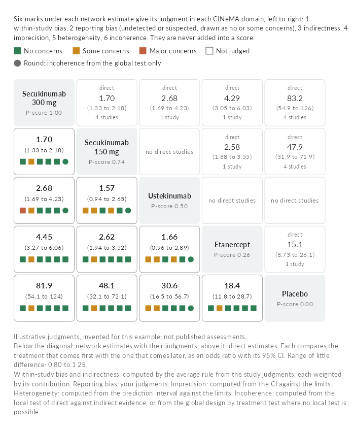](https://choxos.github.io/ggextreme/articles/cinema.html)

The study judgments in the example are illustrative, not published
assessments.

## Funnel plots

`ggfunnel()` draws the funnel plot of a metafor or meta fit, shaded where a
study would be significant against no effect, so a gap where studies would
not be significant points to publication bias rather than heterogeneity.
Hovering over a study shows its effect, weight and risk of bias; clicking it
gives the pooled estimate without it. With `trim_fill = TRUE` the imputed
studies and the adjusted estimate are added behind a switch, and a collapsed
section under the plot gives Egger's and Begg's tests.

```r
ggfunnel(fit, hover = c("alloc", "ablat"), trim_fill = TRUE)
```

[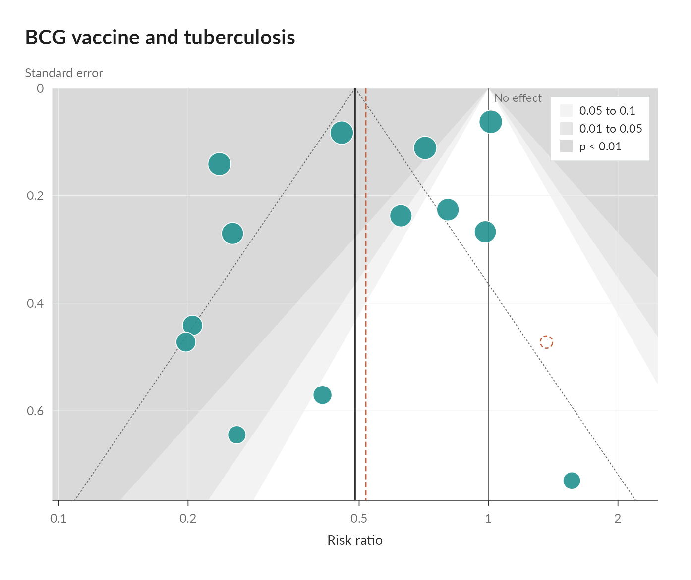](https://choxos.github.io/ggextreme/articles/funnel-plots.html)

## Kaplan-Meier plots

`ggkm()` draws Kaplan-Meier curves by group from a `Surv(time, status) ~
group` formula. Hovering anywhere along the time axis shows each group's
survival with its confidence interval, the number at risk and the events so
far, and the hazard ratio against the reference group at that time, from the
smoothed Schoenfeld residuals or a time interaction model, while the matching
column of the risk table lights up. With `ph_tests = TRUE`, a collapsed
section under the plot gives the Cox hazard ratios, the log-rank test, the
Grambsch and Therneau test and the group by time and group by log time
interactions.

```r
ggkm(Surv(years, status) ~ arm, data = colon, ph_tests = TRUE,
     xlab = "Years since randomization")
```

[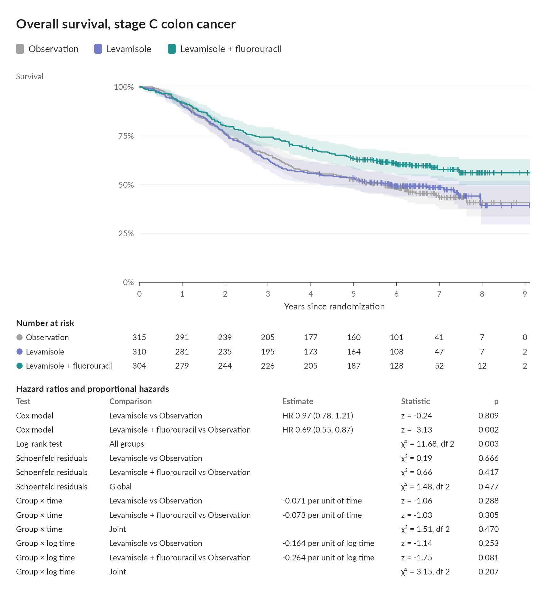](https://choxos.github.io/ggextreme/articles/kaplan-meier.html)

`rmst = 5` adds the restricted mean survival time up to five years, with
each arm's mean and its difference from the reference, and a slider that
moves the horizon while the prespecified one stays marked.

`animate_km()` draws the curves over follow-up as a GIF or MP4:


## Swimmer plots

`ggswimmer()` gives every patient a lane: the time on treatment or on study,
with responses, progression, relapse and death marked along it and an arrow
for patients still ongoing. Hovering over a lane shows the patient's record
and fades the rest, clicking it lists their events in order, and buttons
under the plot reorder the lanes by duration, arm or best response.

```r
ggswimmer(aml, id, futime / 30.44, events = events, group = arm,
          ongoing = death == 0, ongoing_label = "Alive at last follow-up",
          xlab = "Months since randomization")
```

[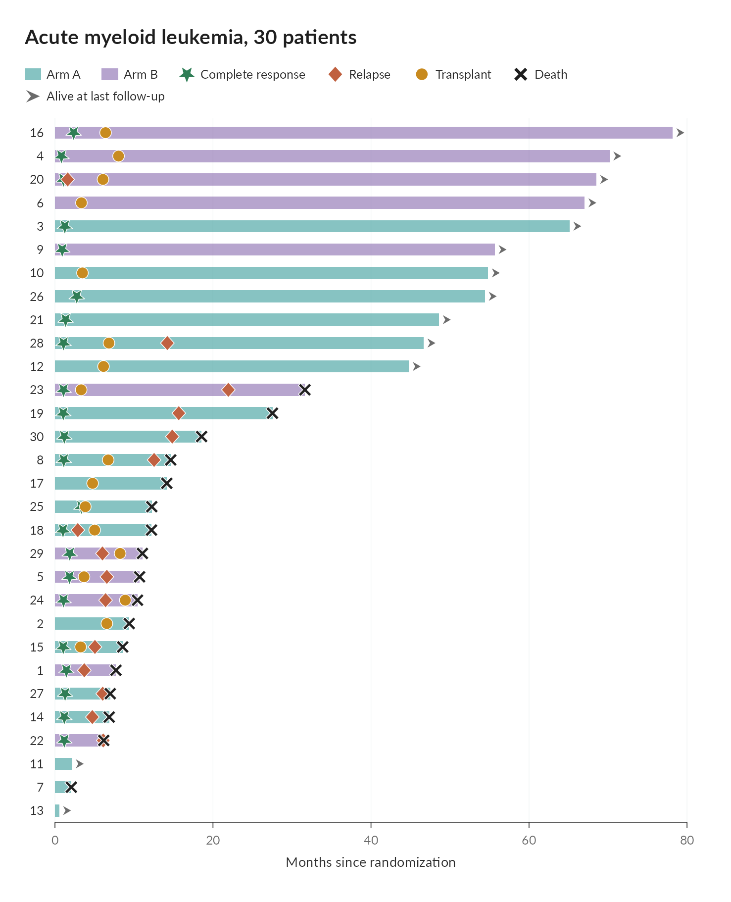](https://choxos.github.io/ggextreme/articles/swimmer-plots.html)

`waterfall` adds each patient's best change from baseline beside their lane,
and `trajectories` their change over time under the lanes, with the response
and progression thresholds marked; hovering over a patient in any panel
lights them in all three.

## Responder thresholds

`ggresponder()` draws, for two arms, the share of patients who improved by
at least each amount, with the prespecified threshold marked, beside the
difference in responders at every threshold, and a table of responders,
their difference, the number needed to treat and the mean difference. A
slider moves the threshold.

```r
ggresponder(change ~ arm, pain, threshold = 2, higher_is_better = FALSE)
```

[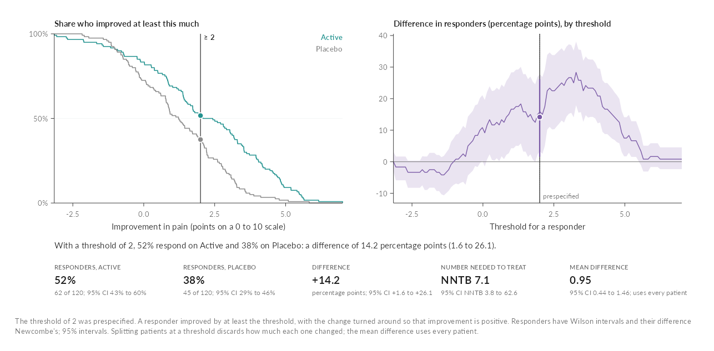](https://choxos.github.io/ggextreme/articles/responder-thresholds.html)

## Diagnostic thresholds

`ggdiagnostic()` shows what a cutoff on a continuous test means: the
marker's distributions, the ROC curve and the predictive values across
prevalence, above a grid of 1,000 people found, missed, falsely alarmed or
cleared, and a table of every measure with its interval. Drag the cutoff,
or set the prevalence of the population the test is for.

```r
pima <- rbind(MASS::Pima.tr, MASS::Pima.te)
ggdiagnostic(type ~ glu, pima, cutoff = 126, prevalence = 0.1,
             labels = c("No diabetes", "Diabetes"))
```

[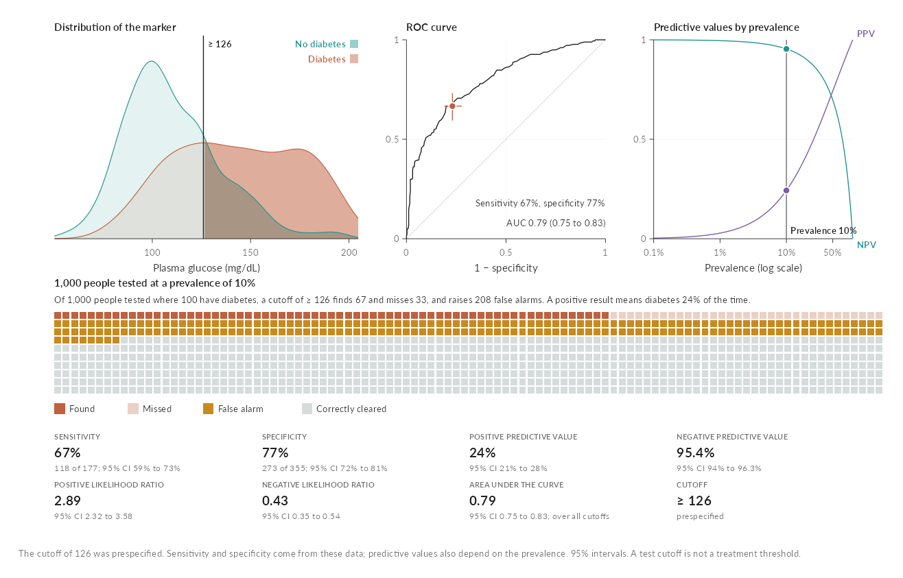](https://choxos.github.io/ggextreme/articles/diagnostic-thresholds.html)

## Bias and tipping points

`ggsensitivity()` shades every pair of strengths an unmeasured confounder
could have by what would survive it, marks the E-values for the estimate
and its confidence limit, and compares measured covariates as benchmarks.
Click the surface to choose a confounder.

```r
ggsensitivity(1.8, 1.4, 2.31, important = 1.25,
              benchmarks = data.frame(label = c("Age", "Smoking"),
                                      exposure = c(1.6, 2.3), outcome = c(1.9, 1.5)))
```

[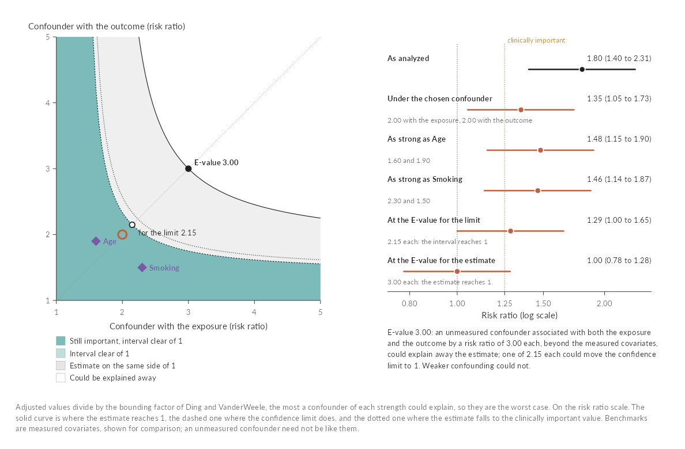](https://choxos.github.io/ggextreme/articles/bias-sensitivity.html)

## A multiverse of analyses

`ggmultiverse()` draws every analysis of one question, one row of the data
each, as a specification curve above a grid of the choices behind it, with
the median estimate for each choice. Drag across the curve, or click a
choice, to see what the analyses in view share.

```r
ggmultiverse(specs, or, lo, hi,
             decisions = c("outcome", "adjustment", "model", "missing", "sample"),
             primary = outcome == "Primary definition" & adjustment == "Standard",
             ylab = "Odds ratio")
```

[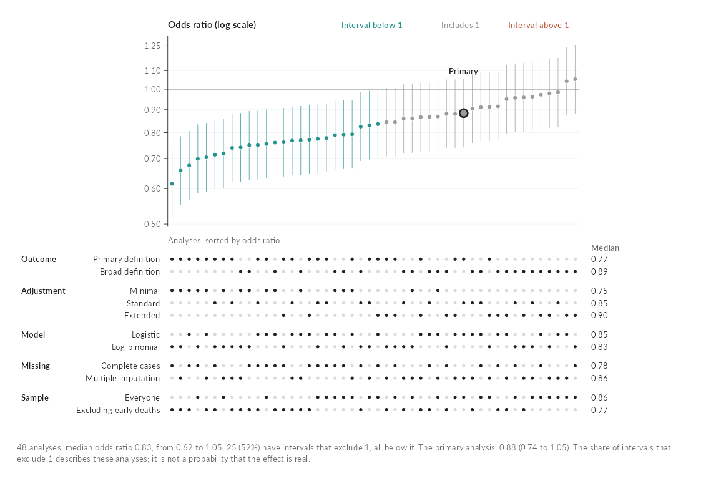](https://choxos.github.io/ggextreme/articles/multiverse.html)

## Nomograms

`ggnomogram()` draws the nomogram of a fitted model and gives every
predictor a handle: drag it, click a category or use the arrow keys, and the
points, the total and the prediction with its 95% confidence interval follow.
It reads linear, generalized linear, mixed (lme4, nlme, glmmTMB), Cox,
parametric survival, ordinal and multinomial models, and models from rms and
mgcv. Splines, polynomials and interactions work, because the points come
from the model's design matrix, and every class is checked against its own
`predict()`.

```r
fit <- glm(low ~ splines::ns(age, 3) + lwt + race + smoke * ht,
           family = binomial, data = bw)
ggnomogram(fit, outcome = "Risk of low birth weight")
```

[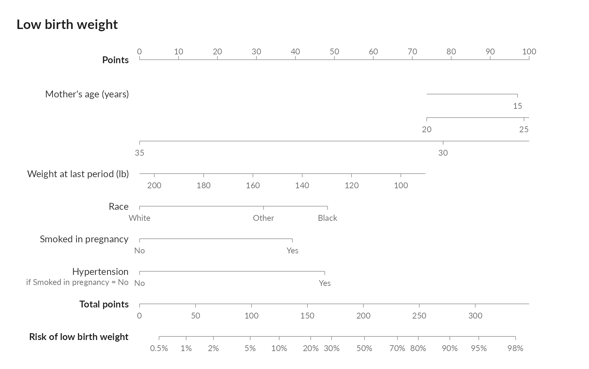](https://choxos.github.io/ggextreme/articles/nomograms.html)

## Choropleth maps

`ggchoropleth()` colors every country by a measure, one map per measure side
by side, with a slider and a play button under them that step through the
years. All the maps show the same year: hovering over a country outlines it
on every map and lists its value and rank on each measure, and clicking it
opens its whole series. Countries match by ISO code or by name, including the
forms the WHO and the Global Burden of Disease study use, and any 'sf' map
of polygons can replace the bundled world map.

```r
qci <- clefts_qci_world
first <- qci$qci[qci$year == 1990][match(qci$iso3, qci$iso3[qci$year == 1990])]
qci$change <- qci$qci - first

ggchoropleth(qci, iso3, year,
             values = c("Quality of Care Index" = "qci",
                        "Change since 1990" = "change"),
             title = "Quality of care for orofacial clefts")
```

[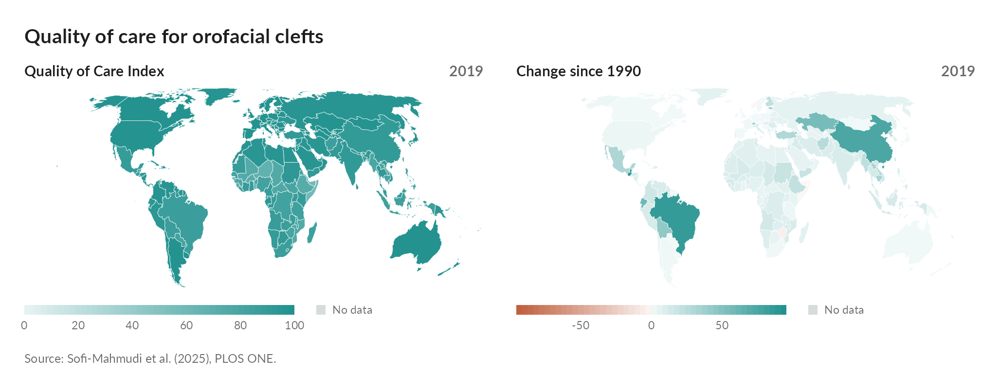](https://choxos.github.io/ggextreme/articles/choropleth-maps.html)

`animate_choropleth()` plays the years as a GIF or MP4:


## Dark pages

Every interactive graph follows the page it sits on. On a dark 'pkgdown' or
'bslib' page, a dark Quarto theme or a saved page viewed in dark mode, the
background, text, lines and neutral fills take dark counterparts, colors that
carry meaning keep their hue, and the hover cards and panels follow, even when
the page switches theme while it is open. `graph_widget(x, theme = "dark")`
fixes the theme, and `graph_save(x, "plot.png", theme = "dark")` writes a
dark static copy.

## Bundled data

`clefts_qci` gives the Quality of Care Index for orofacial clefts in fifteen
countries from 1990 to 2019. The index is a composite of four secondary
indices derived from Global Burden of Disease estimates, summarized by
principal component analysis and rescaled from 0 to 100.

> Sofi-Mahmudi A, Shamsoddin E, Khademioore S, Khazaei Y, Vahdati A,
> Tovani-Palone MR (2025). Global, regional, and national survey on burden
> and Quality of Care Index (QCI) of orofacial clefts: Global burden of
> disease systematic analysis 1990-2019. *PLOS ONE* 20(1): e0317267.
> <https://doi.org/10.1371/journal.pone.0317267>

`clefts_qci_world` holds the full country panel of the same analysis: 195
countries and territories, named as the Global Burden of Disease study names
them and with their ISO 3166-1 alpha-3 codes.

`psoriasis_nma` gives arm level baseline characteristics and PASI 75
response for five randomized trials in plaque psoriasis (CLEAR, ERASURE,
FEATURE, FIXTURE and JUNCTURE), as compiled by Phillippo (2019) and
distributed with the 'multinma' package. They were analyzed in Phillippo et
al. (2020), *Journal of the Royal Statistical Society Series A* 183(3):
1189-1210, <https://doi.org/10.1111/rssa.12579>.

`cleft_dag` is a small illustrative causal diagram for maternal smoking and
orofacial clefts. Its rationales were written for the package as a teaching
example, and every reference it cites was checked against PubMed.

## License

MIT. The package bundles the Lato typeface, and a web subset of it for the
interactive graphs, under the SIL Open Font License (`inst/fonts/OFL.txt`),
and country flag artwork from the flag-icons project under the MIT License,
with two exceptions noted in `inst/extdata/flags/SOURCE.txt`. The world map
is simplified from Natural Earth's 1:50m countries, which are in the public
domain.
