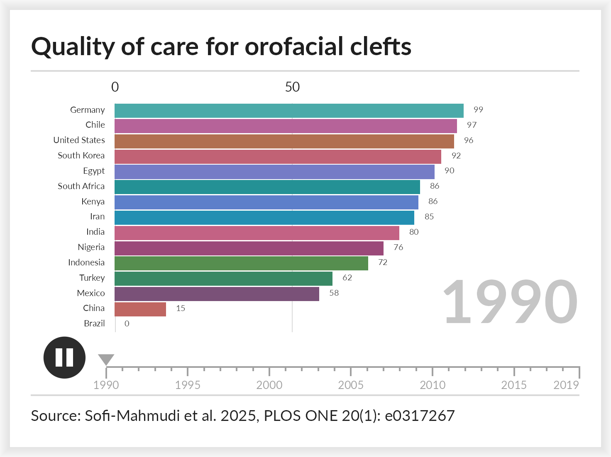
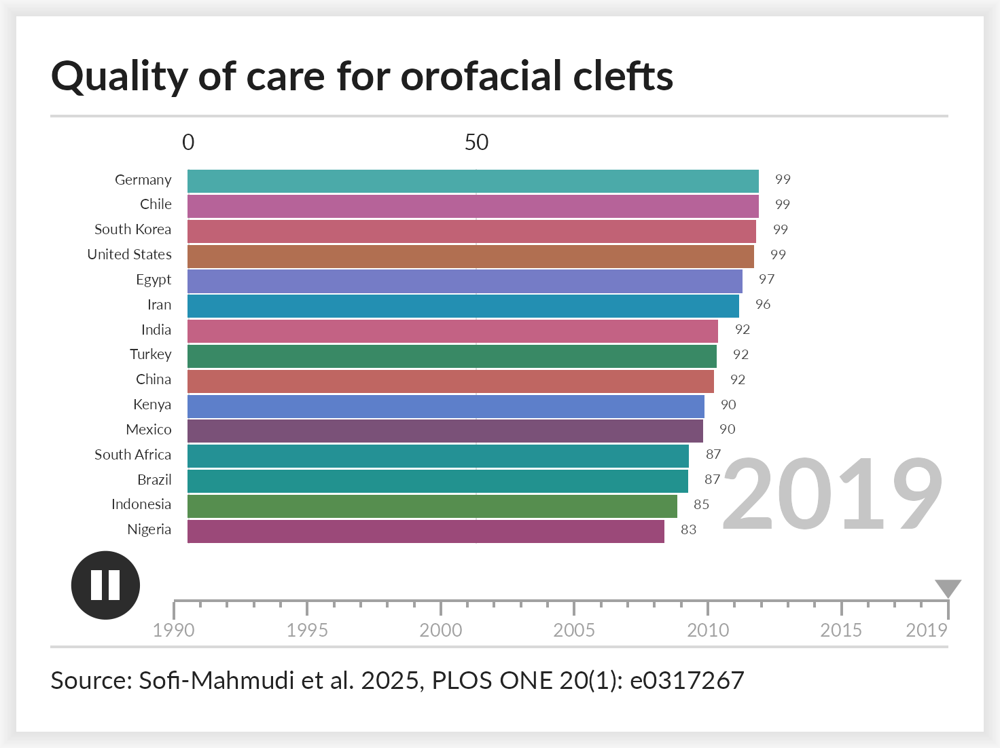
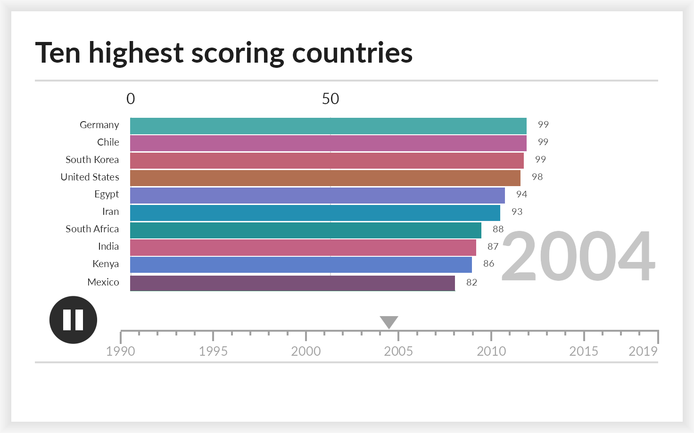
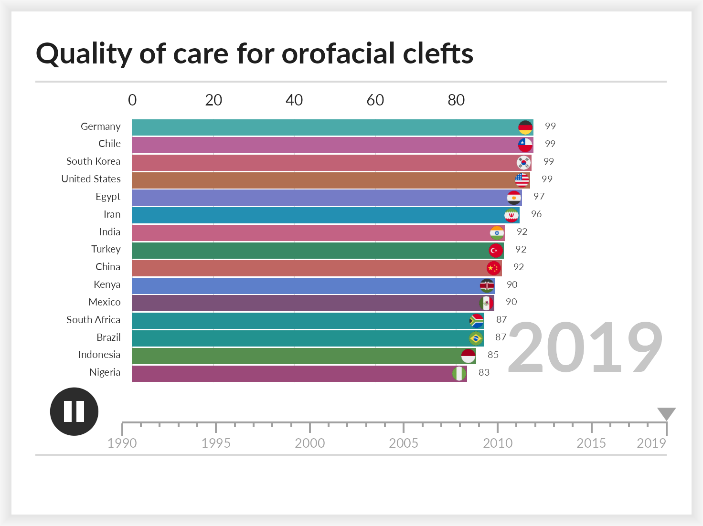

# Bar chart races

A bar chart race shows how a ranking changes over time. It suits panel
data where the same entities are measured repeatedly and their order is
the point: which countries lead, which have caught up, when a position
changed hands. This vignette covers the data it expects, the arguments
that shape it, and how to write the animation to a file.

``` r

library(ggextreme)
```

## The data

[`ggrace()`](https://choxos.github.io/ggextreme/reference/ggrace.md)
takes long data with one row per entity per time point and three bare
column names: the value that sets the bar length, the label, and the
time.

``` r

head(clefts_qci)
#>   country iso year       qci
#> 1  Brazil  br 1990  0.000000
#> 2  Brazil  br 1991  2.922546
#> 3  Brazil  br 1992  6.361471
#> 4  Brazil  br 1993 12.062058
#> 5  Brazil  br 1994 19.362466
#> 6  Brazil  br 1995 29.275937
```

`clefts_qci` holds the Quality of Care Index for orofacial clefts in
fifteen countries from 1990 to 2019, taken from Sofi-Mahmudi et
al. (2025). Higher is better care. Each country appears once per year,
which is what the function requires: a repeated country and year pair is
an error rather than a silent average.

``` r

race <- ggrace(
  clefts_qci,
  value = qci,
  name = country,
  time = year,
  top_n = 15,
  duration = 15,
  title = "Quality of care for orofacial clefts",
  caption = "Source: Sofi-Mahmudi et al. 2025, PLOS ONE 20(1): e0317267"
)

race
#> <ggrace>
#>  entities: 15 (top 15 shown)
#>  keyframes: 30 
#>  frames:   900 at 60 fps
```

The object holds one row per entity per frame, already interpolated.
Nothing has been drawn yet.

``` r

head(race$frames)
#>   frame time    name    value rank
#> 1     1 1990  Brazil  0.00000   15
#> 2     1 1990   Chile 96.70909    2
#> 3     1 1990   China 14.52871   14
#> 4     1 1990   Egypt 90.42298    5
#> 5     1 1990 Germany 98.60005    1
#> 6     1 1990   India 80.40029    9
```

## Looking at one frame

Every frame is an ordinary `ggplot` object, so it can be printed, saved
with
[`ggplot2::ggsave()`](https://ggplot2.tidyverse.org/reference/ggsave.html),
or inspected before committing to a full render.

``` r

race_frame(race, 1)
```



``` r

race_frame(race, race$n_frames)
```



Frames are set in Lato, which the package registers when it loads.
Devices that understand registered fonts, such as
[`ragg::agg_png()`](https://ragg.r-lib.org/reference/agg_png.html), will
use it; the older [`pdf()`](https://rdrr.io/r/grDevices/pdf.html) and
[`png()`](https://rdrr.io/r/grDevices/png.html) devices will not, so
draw with ragg or pass `family = ""` to fall back to the device default.

## Writing the animation

[`animate_race()`](https://choxos.github.io/ggextreme/reference/animate_race.md)
draws every frame and encodes them. The encoder follows the file
extension: `.gif` uses gifski, falling back to magick, and anything else
is treated as video and uses av, falling back to an `ffmpeg` binary on
the search path.

``` r

animate_race(race, "clefts.mp4")
animate_race(race, "clefts.gif")
```

Frames are independent, so they are drawn across cores by default. Pass
`cores = 1` to force a single core, which is also what happens on
Windows.

## Arguments worth knowing

| argument | effect |
|----|----|
| `top_n` | how many bars are visible at once |
| `duration`, `fps`, `end_pause` | length in seconds, frame rate, hold on the last frame |
| `swap` | seconds a bar takes to move into a new rank |
| `palette` | a colour vector, or one named by entity |
| `breaks` | gridline positions, a function or a fixed vector |
| `label_value`, `label_time` | formatters for the bar numbers and the large time label |
| `images` | pictures to sit at the end of the bars |
| `timeline`, `play_button`, `card` | turn off the timeline strip, the button, or the card |
| `width`, `res` | output size; the whole layout scales with `width` |

`top_n` smaller than the field is where a race earns its keep. Entities
outside the visible window wait just below it and slide in when they
qualify.

``` r

top10 <- ggrace(
  clefts_qci, qci, country, year,
  top_n = 10,
  duration = 15,
  title = "Ten highest scoring countries"
)

race_frame(top10, round(top10$n_frames / 2))
```



## Images on the bars

`images` takes a character vector of image file paths named by entity.
Pictures are cropped to a circle and right aligned just inside the end
of the bar. Entities with no image simply get none.

The package bundles a circular flag for every ISO 3166-1 country, plus
Kurdistan, so country races need no extra files.
[`race_flags()`](https://choxos.github.io/ggextreme/reference/race_flags.md)
maps names or codes to those paths.

``` r

key <- unique(clefts_qci[c("country", "iso")])
flags <- setNames(race_flags(key$iso), key$country)

flagged <- ggrace(
  clefts_qci, qci, country, year,
  top_n = 15,
  duration = 15,
  images = flags,
  breaks = scales::breaks_extended(6),
  title = "Quality of care for orofacial clefts"
)

race_frame(flagged, flagged$n_frames)
```



Lookup tries the two letter code, the three letter code, the full
country name, then a unique partial match. The names follow the World
Bank style, so a few common spellings do not match and the code is the
reliable key.

``` r

subset(race_flag_codes(), grepl("Korea|Turk", country))
#>     code code3                   country
#> 117   kp   prk Korea, Dem. People's Rep.
#> 118   kr   kor               Korea, Rep.
#> 208   tc   tca  Turks and Caicos Islands
#> 216   tm   tkm              Turkmenistan
#> 219   tr   tur                   Turkiye
```

Any image works, not only flags: pass paths to logos, portraits or team
crests in the same way.

## References

Sofi-Mahmudi A, Shamsoddin E, Khademioore S, Khazaei Y, Vahdati A,
Tovani-Palone MR (2025). Global, regional, and national survey on burden
and Quality of Care Index (QCI) of orofacial clefts: Global burden of
disease systematic analysis 1990-2019. *PLOS ONE* 20(1): e0317267.
