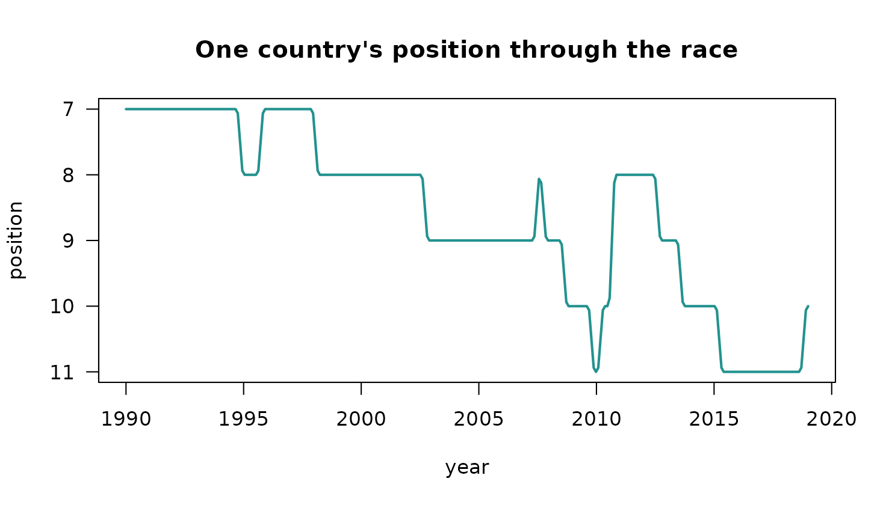

# How the animation works

``` r

library(ggextreme)
```

Most of the difference between an animation that reads well and one that
does not comes down to three decisions: what is interpolated, what is
not, and whether the geometry holds still. This vignette sets out the
choices
[`ggrace()`](https://choxos.github.io/ggextreme/reference/ggrace.md)
makes, since they are the parts worth arguing with.

## Values move at a constant rate

Observations are keyframes.
[`ggrace()`](https://choxos.github.io/ggextreme/reference/ggrace.md)
lays a uniform grid of `duration * fps` time points across the observed
range and interpolates each entity’s value linearly onto it.

Two things follow. Bars grow at a steady rate rather than easing in and
out of every observation, which would read as a pulse once per time
step. And the grid is uniform in real time, not in keyframes, so
unevenly spaced observations play at their true relative speed instead
of each gap taking the same number of frames.

``` r

race <- ggrace(clefts_qci, qci, country, year, top_n = 15,
               duration = 15, fps = 20)

range(diff(race$times))
#> [1] 0.09698997 0.09698997
```

An entity that is absent at some time points is bridged linearly between
the observations that do exist. One that is absent at the ends holds its
nearest observed value, and is kept out of the ranking while it is
missing.

## Rank does not move at a constant rate

Rank is treated differently, and this is the decision that most affects
how the animation reads. Interpolating rank linearly between two
observations puts every overtaking bar in motion for the whole time
step, so a field of any size is permanently drifting and the labels
never settle.

Instead, every frame is ranked on its own interpolated values, which
gives a step function per entity, and the drawn position eases from the
old rank to the new one over `swap` seconds with a cubic in and out
curve. Bars therefore rest in place and change positions in one short,
deliberate move.

``` r

kenya <- subset(race$frames, name == "Kenya")
plot(kenya$time, -kenya$rank, type = "l", lwd = 2, col = "#22928F",
     xlab = "year", ylab = "position", yaxt = "n",
     main = "One country's position through the race")
axis(2, at = -(1:15), labels = 1:15, las = 1)
```



The flat sections are the bar sitting still; the short ramps are the
swaps. Shorten `swap` for a snappier chart, lengthen it for a slower
one.

``` r

sum(abs(diff(kenya$rank)) > 1e-8)  # frames spent moving
#> [1] 55
nrow(kenya)                        # frames in total
#> [1] 300
```

## Ranks are clamped just below the visible window

Anything outside the top `top_n` is parked at rank `top_n + 1`, one slot
below the bottom edge. An entity in twentieth place that climbs into a
top ten therefore enters from just under the axis rather than flying up
from far off screen, and the same clamp handles entities that are
missing from the data at a given time.

``` r

top5 <- ggrace(clefts_qci, qci, country, year, top_n = 5, duration = 15)
range(top5$frames$rank)
#> [1] 1 6
```

## The geometry never moves

A frame is a single `ggplot` drawn in card units: the title, axis, bars,
timeline and footer are all layers in one coordinate system, positioned
by number rather than by a layout engine.

That is deliberate. If the bar labels were axis text, the width of the
label column would depend on which entities happen to be visible, so the
panel would shift sideways by a few pixels whenever the longest name
entered or left the top `n`. Over a few hundred frames that shift is a
visible jitter. Here the label column has a fixed width and the panel
edges are constants.

The axis carries no headroom. The longest bar always reaches the right
edge of the plotting area and the axis maximum is the largest value in
the current frame, so gridlines drift as the field grows.

Colours are assigned once across the whole field, not per frame, so an
entity keeps its colour when it drops out of the visible window and
comes back.

``` r

head(race$colors, 4)
#>    Brazil     Chile     China     Egypt 
#> "#22928F" "#B66399" "#757CC6" "#568E4F"
```

## What a frame is made of

Each frame is five or six layers, not one per element. Collapsing the
rectangles into a single
[`geom_rect()`](https://ggplot2.tidyverse.org/reference/geom_tile.html)
and the text into a single
[`geom_text()`](https://ggplot2.tidyverse.org/reference/geom_text.html)
is what keeps a long render from crawling, since a ggplot’s build cost
scales with the number of layers.

``` r

frame <- race_frame(race, 100)
length(frame$layers)
#> [1] 6
vapply(frame$layers, function(l) class(l$geom)[1], character(1))
#>     geom_rect     geom_text geom_rect...3  geom_polygon geom_rect...5 
#>    "GeomRect"    "GeomText"    "GeomRect" "GeomPolygon"    "GeomRect" 
#> geom_text...6 
#>    "GeomText"
```

Because it is a plain `ggplot`, a frame can be modified like any other,
with the caveat that the coordinate system is in card units rather than
data units.

## Cost

Drawing is the expensive part, at roughly a third of a second per frame
on eight cores. A thirty second animation at 30 frames per second is 900
frames, so a few minutes. `fps` and `duration` are the two knobs that
matter; `width` and `res` change the cost far less than they change the
file size.
