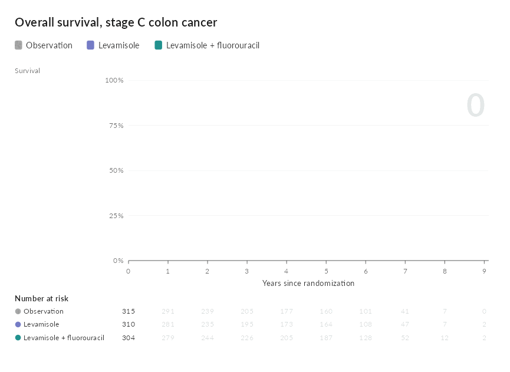

# Kaplan-Meier plots

A Kaplan-Meier plot answers one question at a glance, and a dozen more
only if the reader can read values off it: what survival was at two
years, how many patients were still being followed, and whether the
hazard ratio reported with it holds across follow-up.
[`ggkm()`](https://choxos.github.io/ggextreme/reference/ggkm.md) puts
those answers under the pointer. Hovering anywhere along the time axis
reads every group at that time, with the hazard ratio at that time, and
an optional section under the plot reports the proportional hazards
tests alongside the hazard ratios.

``` r

library(ggextreme)
```

## A first plot

The example is the Intergroup trial of adjuvant levamisole and
fluorouracil in stage C colon cancer, which ships with the survival
package.

``` r

colon <- subset(survival::colon, etype == 2)
colon$years <- colon$time / 365.25
colon$arm <- factor(colon$rx,
                    labels = c("Observation", "Levamisole",
                               "Levamisole + fluorouracil"))

km <- ggkm(
  survival::Surv(years, status) ~ arm,
  data = colon,
  ph_tests = TRUE,
  xlab = "Years since randomization",
  title = "Overall survival, stage C colon cancer"
)
km
```

Move the pointer along the plot. The card gives each arm’s survival with
its 95% confidence interval, the number still at risk and the events so
far, then the hazard ratio against observation at that time, while the
matching column of the risk table lights up. Click to open the full
readout for that time, which compares the hazard ratio from every
method. Hover over a curve for the arm’s summary, and click it for
survival at each time on the axis.

## The hazard ratio over time

A Cox model reports one hazard ratio for the whole of follow-up, which
holds only if the hazards are proportional. `hr_time` sets how the
hazard ratio at each time is estimated:

| `hr_time` | estimate at time t |
|----|----|
| `"schoenfeld"` | the smoothed scaled Schoenfeld residuals, the curve [`survival::plot.cox.zph()`](https://rdrr.io/pkg/survival/man/plot.cox.zph.html) draws; the default |
| `"log"` | a Cox model with a group by log time interaction |
| `"linear"` | a Cox model with a group by time interaction |
| `"constant"` | the Cox estimate, the same at every time |
| `"none"` | no hazard ratio in the hover card |

The scaled Schoenfeld residuals estimate the log hazard ratio at each
event time (Grambsch and Therneau 1994), and smoothing them with a
natural spline gives its course over follow-up with a confidence band.
The two interaction models impose a shape instead: a log hazard ratio
that changes linearly in time or in log time. Where they agree, the
answer does not hang on the method.

## Proportional hazards tests

`ph_tests = TRUE` adds a section under the plot, collapsed until the
reader opens it, with the hazard ratios and the tests of proportional
hazards. It is off by default, since the interaction models take a few
seconds to fit on a large trial. The table is also returned as a data
frame:

``` r

km$ph
#>                    test                               comparison
#> 1             Cox model                Levamisole vs Observation
#> 2             Cox model Levamisole + fluorouracil vs Observation
#> 3         Log-rank test                               All groups
#> 4  Schoenfeld residuals                Levamisole vs Observation
#> 5  Schoenfeld residuals Levamisole + fluorouracil vs Observation
#> 6  Schoenfeld residuals                                   Global
#> 7          Group × time                Levamisole vs Observation
#> 8          Group × time Levamisole + fluorouracil vs Observation
#> 9          Group × time                                    Joint
#> 10     Group × log time                Levamisole vs Observation
#> 11     Group × log time Levamisole + fluorouracil vs Observation
#> 12     Group × log time                                    Joint
#>                       estimate        statistic           p
#> 1         HR 0.97 (0.78, 1.21)        z = -0.24 0.809174301
#> 2         HR 0.69 (0.55, 0.87)        z = -3.13 0.001747549
#> 3                              χ² = 11.68, df 2 0.002904348
#> 4                                     χ² = 0.19 0.666290517
#> 5                                     χ² = 0.66 0.416696850
#> 6                               χ² = 1.48, df 2 0.476943445
#> 7      -0.071 per unit of time        z = -1.06 0.287630028
#> 8      -0.073 per unit of time        z = -1.03 0.305010710
#> 9                               χ² = 1.51, df 2 0.469594021
#> 10 -0.164 per unit of log time        z = -1.14 0.253301079
#> 11 -0.264 per unit of log time        z = -1.75 0.080646010
#> 12                              χ² = 3.15, df 2 0.207143210
```

- **Cox model**: the hazard ratio for each arm against the reference,
  with its Wald test.
- **Log-rank test**: whether survival differs between the arms at all.
- **Schoenfeld residuals**: the Grambsch and Therneau test of a trend in
  the scaled Schoenfeld residuals over time, on the Kaplan-Meier time
  scale, for each comparison and overall.
- **Group × time** and **Group × log time**: the interaction coefficient
  for each comparison, how much the log hazard ratio changes per unit of
  time or log time, with a joint Wald test of all of them.

A note under the table says what each test asks. Here none of the tests
is significant at the 5% level; the closest is the log time interaction
for levamisole plus fluorouracil, at p = 0.08. The Cox hazard ratio of
0.69 for that arm is a reasonable summary of follow-up, and the hover
card shows how far the estimate at each time strays from it.

The interaction models are fitted on data split at every event time, so
they grow with the size of the study; for very large data they are
skipped with a message.

## Restricted mean survival time

When hazards are not proportional, a single hazard ratio can mislead.
The restricted mean survival time up to a horizon τ is the average time
alive, or free of the event, over the first τ units of follow-up: the
area under the curve. `rmst` gives the prespecified horizon, or `TRUE`
for the end of follow-up in the arm followed least.

``` r

rm <- ggkm(survival::Surv(years, status) ~ arm, data = colon, rmst = 5,
           xlab = "Years since randomization")
rm
```

``` r

rm$rmst
#>                       group     rmst    lower    upper  difference  diff_lower
#> 1               Observation 3.666546 3.486934 3.846158          NA          NA
#> 2                Levamisole 3.622394 3.438812 3.805976 -0.04415199 -0.30098448
#> 3 Levamisole + fluorouracil 3.971726 3.794494 4.148958  0.30517998  0.05284752
#>   diff_upper
#> 1         NA
#> 2  0.2126805
#> 3  0.5575124
```

The plot shades the reference arm’s area and the difference each other
arm makes, and a table under the risk table gives each arm’s mean with
its confidence interval and its difference from the reference. In the
widget, a slider moves the horizon, the shading and the table follow,
and a sentence says what the difference means at that horizon; the
prespecified horizon stays marked and one button returns to it. A
horizon chosen after looking at the curves is exploratory, and the
differences treat the arms as independent.

## Options

| argument | effect |
|----|----|
| `type` | `"survival"`, or `"risk"` for the cumulative incidence |
| `reference` | the group the hazard ratios compare against |
| `breaks` | times for the axis and the risk table |
| `risk_table`, `ph_tests`, `conf_int` | show the risk table, the collapsed tests and the bands |
| `palette` | group colors; the reference group defaults to gray |

## Dark pages

On a dark page the plot takes a dark palette of its own, and follows a
page that switches theme while it is open, like this site’s light and
dark switch. `graph_widget(km, theme = "dark")` fixes it, and
`graph_save(km, "km.png", theme = "dark")` writes a dark static copy for
slides.

## Drawing the curves over follow-up

[`animate_km()`](https://choxos.github.io/ggextreme/reference/animate_km.md)
draws the curves as though the trial were being watched, with the
numbers at risk appearing as each time on the axis is reached, and
writes a GIF or MP4 for a talk:

``` r

animate_km(km, "colon.gif")
```


