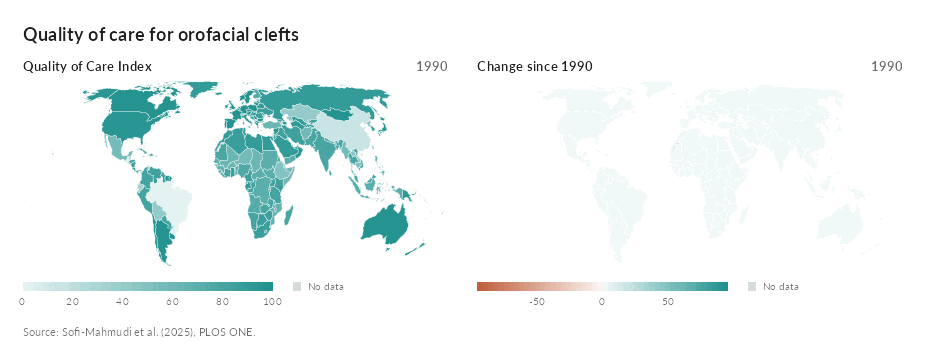

```{r, include = FALSE}
knitr::opts_chunk$set(
  collapse = TRUE,
  comment = "#>"
)
```

A map of a health measure by country is usually drawn for one year, and the
question a reader asks next is how it got there. `ggchoropleth()` draws the
map with a slider and a play button under it that step through the years,
and puts several measures side by side, always for the same year, so a
country's measures read together.

```{r setup}
library(ggextreme)
```

## A first map

`clefts_qci_world` holds the Quality of Care Index (QCI) for orofacial clefts
in 195 countries from 1990 to 2019, from a Global Burden of Disease analysis.
The index runs from 0 to 100, where higher is better care. The panel has one
measure, so the second map here is derived from it: the change in each
country's index since 1990.

```{r}
qci <- clefts_qci_world
first <- qci$qci[qci$year == 1990][match(qci$iso3, qci$iso3[qci$year == 1990])]
qci$change <- qci$qci - first

m <- ggchoropleth(
  qci, iso3, year,
  values = c("Quality of Care Index" = "qci",
             "Change since 1990" = "change"),
  title = "Quality of care for orofacial clefts",
  caption = "Source: Sofi-Mahmudi et al. (2025), PLOS ONE."
)
m
```

Drag the slider or press play to move through the years; both maps change
together. Hover over a country to outline it on both maps and read its index
and its change that year, each with the country's rank among all those with
data. Rank 1 is the highest value that year, which is the best for this
index but would be the worst for a measure such as mortality. Click it to open its whole series under the maps, one small chart per
measure with the year on the slider marked.

## Naming the regions

`region` can hold ISO 3166-1 alpha-3 codes, as here, alpha-2 codes, or
English names. Names match whatever their case, accents or punctuation, and
the forms the WHO and the Global Burden of Disease study use, such as "Iran
(Islamic Republic of)" or "Côte d'Ivoire", are recognized. Places that are
not countries, such as world regions or income groups, are left out with a
message that names them. The `country` column of `clefts_qci_world` keeps
the study's own names; with two aggregate rows added, the map still finds
every country:

```{r}
gbd <- subset(clefts_qci_world, year == 2019, select = c(country, year, qci))
head(gbd$country[grepl("(", gbd$country, fixed = TRUE)])
gbd <- rbind(gbd, data.frame(country = c("Global", "High SDI"), year = 2019,
                             qci = NA))
by_name <- ggchoropleth(gbd, country, year, values = c(QCI = "qci"))
```

The hover card names a country as the data does, unless the data gave codes,
in which case it uses the map's own names.

## Scales

Each measure has its own color scale, fixed across the years, so a change of
shade on the slider is a change of value. The index runs from 0 to 100 and
gets a sequential scale: one color, stronger for higher values. The change
since 1990 has values on both sides of zero, so it gets a diverging scale
centered on zero, with one color for a fall and another for a rise. Countries
without data for a year are gray.

`palette` sets the colors, one entry per measure, in order or named by the
map's label. One color gives a sequential scale and two give a diverging one:

```{r, eval = FALSE}
ggchoropleth(qci, iso3, year,
             values = c("Quality of Care Index" = "qci",
                        "Change since 1990" = "change"),
             palette = list("Quality of Care Index" = "#3F74B5",
                            "Change since 1990" = c("#B03A2E", "#1E8449")))
```

The shades are one color drawn with increasing strength over the page, which
keeps them readable on a light page and a dark one alike.

## Any map

The world map is bundled with the package: Natural Earth's 1:50m countries in
the Equal Earth projection, simplified to the detail the maps are drawn at.
Any other map can be given as an 'sf' object of polygons, with `map_id`
naming the column that `region` matches. Here are the sudden infant death
syndrome counts of North Carolina's counties, which ship with 'sf', as a rate
per 1,000 births for the two periods the data cover:

```{r, eval = requireNamespace("sf", quietly = TRUE)}
nc <- sf::st_read(system.file("shape/nc.shp", package = "sf"), quiet = TRUE)
sids <- rbind(
  data.frame(county = nc$NAME, period = 1974, rate = 1000 * nc$SID74 / nc$BIR74),
  data.frame(county = nc$NAME, period = 1979, rate = 1000 * nc$SID79 / nc$BIR79)
)
ggchoropleth(sids, county, period,
             values = c("SIDS deaths per 1,000 births" = "rate"),
             map = nc, map_id = "NAME",
             title = "Sudden infant death syndrome, North Carolina",
             caption = "Periods starting 1974 and 1979.")
```

A map in longitude and latitude, like this one, is scaled so a degree of
longitude has its true length at the middle of the map; a projected map is
drawn as it comes. Detailed boundaries make a heavy page, so simplify them
first with `sf::st_simplify()`.

## Options

| argument | effect |
| --- | --- |
| `values` | the columns to map, one map each, named by their labels |
| `at` | the year shown first, and in static copies; the last by default |
| `ncol` | maps per row; two by default |
| `palette` | one color per measure for a sequential scale, two for a diverging one |
| `interval` | seconds each year is shown while playing |
| `map`, `map_id` | an 'sf' map in place of the world, and its key column |

## Dark pages

On a dark page the maps take a dark palette of their own, and follow a page
that switches theme while it is open, like this site's light and dark switch.
`graph_widget(m, theme = "dark")` fixes it, and
`graph_save(m, "map.png", theme = "dark")` writes a dark static copy of the
year `at`.

## Playing the years

`animate_choropleth()` plays the years into a GIF or MP4 for a talk, easing
each country from one year's shade to the next:

```{r, eval = FALSE}
animate_choropleth(m, "qci.gif", step = 0.4)
```

```{r, echo = FALSE, out.width = "100%"}

```
